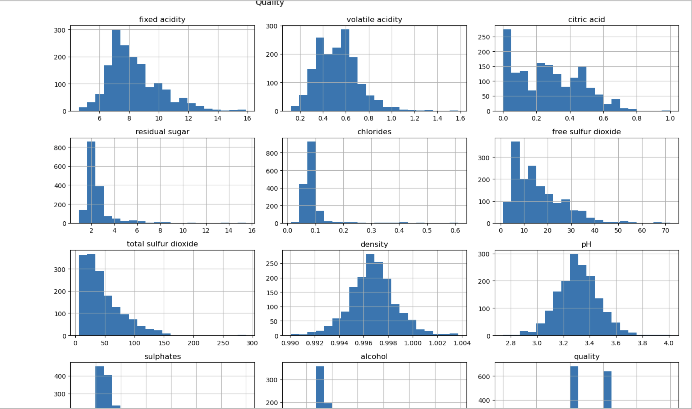
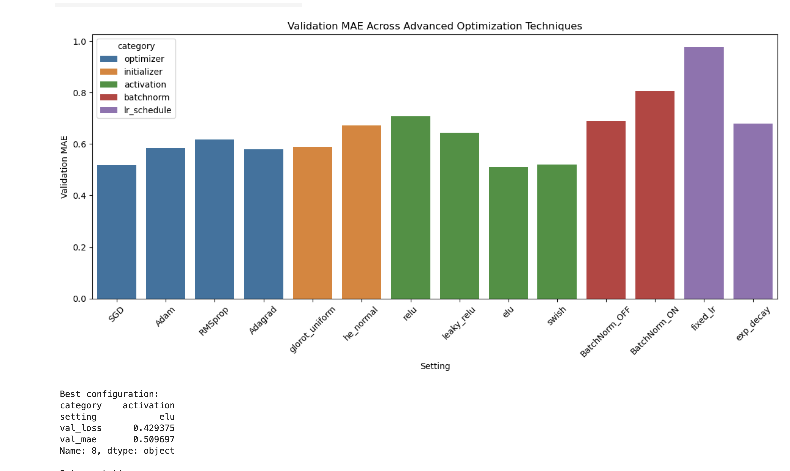
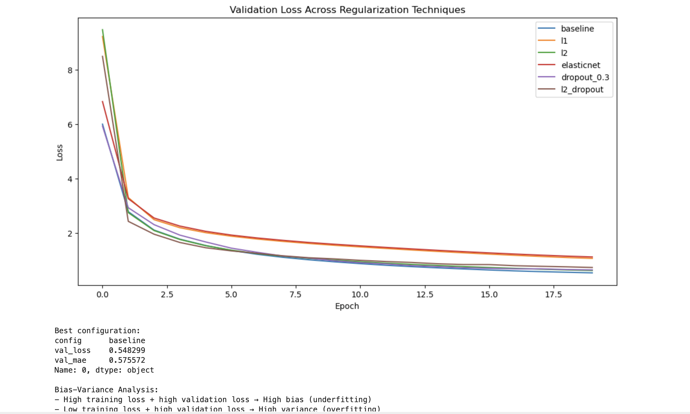

# Neural-Networks-Advanced-Backpropagation

Deep learning project exploring neural networks, advanced backpropagation, optimization strategies, regularization methods, feature engineering, and neural model performance analysis.

---

## Visualizations

### Wine Feature Distributions

Exploratory data analysis showing wine quality distributions and feature behavior across the dataset used for neural network training.



### Optimization Comparison

Comparison of advanced optimization techniques including optimizers, initialization methods, activation functions, batch normalization, and learning-rate scheduling using validation MAE performance.



### Regularization Results

Validation loss comparison across multiple regularization techniques including baseline networks, L1 regularization, L2 regularization, ElasticNet, dropout, and combined regularization methods.



---

## Dataset

This project uses the **Wine Quality Dataset** for regression-based neural network experimentation and advanced backpropagation analysis.

Dataset source:

```text
UCI Machine Learning Repository — Wine Quality Dataset
```

The dataset is stored inside the repository data directory for reproducibility.

---

## Final Model Performance

Best Performing Configuration: **Baseline Neural Network Configuration**

Performance Metrics:

- Validation Loss: **0.5483**
- Validation MAE: **0.5756**
- Task Type: **Regression**
- Dataset: **Wine Quality Dataset**
- Features Used: **13 engineered input features**

---

## Repository Structure

```text
Neural-Networks-Advanced-Backpropagation/
│
├── notebooks/
│   └── Neural_Networks_Advanced_Backpropagation.ipynb
│
├── visuals/
│   ├── wine_feature_distributions.png
│   ├── optimization_comparison.png
│   └── regularization_results.png
│
├── data/
│   └── winequality.csv
│
├── README.md
└── requirements.txt
```

---

## Installation & Execution

Clone repository:

```bash
git clone https://github.com/Dare215/Neural-Networks-Advanced-Backpropagation.git
```

Install dependencies:

```bash
pip install -r requirements.txt
```

Launch notebook environment:

```bash
jupyter notebook
```

---

## Advanced Techniques Explored

This project investigates advanced neural network training and stabilization techniques including:

- Advanced backpropagation workflows
- Gradient-based optimization
- Optimizer comparison (SGD, Adam, RMSProp, Adagrad)
- Weight initialization experimentation
- Activation function analysis
- Batch normalization
- Learning rate scheduling
- Regularization techniques
- Feature engineering
- Regression modeling
- Bias-variance analysis
- Validation performance benchmarking

---

## Future Improvements

Potential future enhancements include:

- Hyperparameter optimization using Optuna or Bayesian optimization.
- Deeper neural architectures with residual connections.
- Gradient clipping and gradient flow visualization.
- Automated neural architecture search (NAS).
- Expanded regularization experiments with advanced dropout strategies.
- Cross-validation benchmarking across larger tabular datasets.
- Explainable AI analysis for feature importance interpretation.
- Deployment using Streamlit or Flask.
- Comparison against ensemble machine learning models.
- Expansion toward biomedical, financial, and operational datasets.

---

## Author

### Darious Brown  
PhD Candidate — Artificial Intelligence & Machine Learning

Areas of Interest:

- Deep Learning
- Neural Networks
- Advanced Optimization
- Backpropagation Analysis
- Predictive Analytics
- Artificial Intelligence Applications
- Biotech AI Applications
- AI-Driven Operational Intelligence

Portfolio:

https://dare215.github.io/DariousBrown-Portfolio/

LinkedIn:

https://www.linkedin.com/in/dariousbrown
