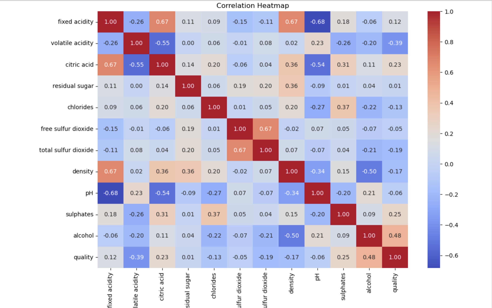
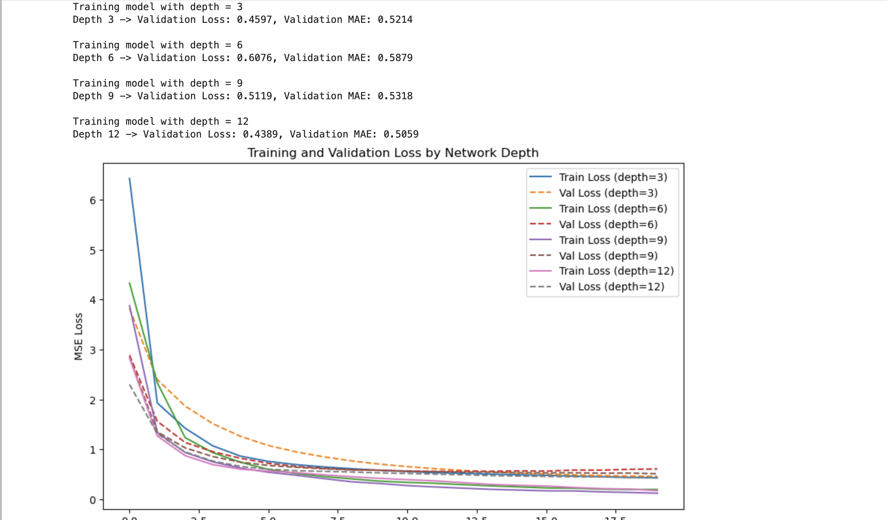

# Neural-Networks-Advanced-Backpropagation

Advanced deep learning project exploring neural network optimization, backpropagation enhancement techniques, regularization strategies, and model performance analysis using the Wine Quality dataset.

---

## Visualizations

### Dataset Analysis

Dataset overview including descriptive statistics, feature inspection, and exploratory data preparation analysis.



### Wine Feature Distributions

Feature distribution analysis across chemical attributes and wine quality measurements.


### Optimization Comparison

Comparison of advanced optimization strategies including optimizers, activation functions, initialization methods, batch normalization, and learning-rate scheduling.


### Regularization Results

Validation loss comparison across multiple regularization methods including L1, L2, ElasticNet, Dropout, and combined regularization approaches.


### Gradient Flow Analysis

Training and validation loss comparison across different neural network depths to analyze gradient behavior and model convergence.



---

## Dataset

This project uses the **Wine Quality Dataset** for supervised regression and neural network experimentation.

Dataset source:

```python
winequality-red.csv
```

Repository structure includes a placeholder data directory.

---

## Final Model Performance

Best Performing Configuration:

- Optimizer: **SGD**
- Activation Function: **ELU**
- Validation Loss: **0.4294**
- Validation MAE: **0.5070**
- Dataset: **Wine Quality Dataset**

Regularization Analysis:

- Best Regularization Configuration: **Baseline**
- Validation Loss: **0.5483**
- Validation MAE: **0.5756**

Network Depth Analysis:

- Best Depth Configuration: **12 Layers**
- Validation Loss: **0.4389**
- Validation MAE: **0.5059**

---

## Repository Structure

```text
Neural-Networks-Advanced-Backpropagation/
│
├── notebooks/
│   └── Neural_Networks_Advanced_Backpropagation.ipynb
│
├── visuals/
│   ├── dataset_analysis.png
│   ├── wine_feature_distributions.png
│   ├── optimization_comparison.png
│   ├── regularization_results.png
│   └── gradient_flow_analysis.png
│
├── data/
│   └── .gitkeep
│
├── README.md
└── requirements.txt
```

---

## Installation & Execution

Clone repository:

```bash
git clone https://github.com/Dare215/Neural-Networks-Advanced-Backpropagation.git
```

Install dependencies:

```bash
pip install -r requirements.txt
```

Run notebook:

```bash
jupyter notebook
```

Open:

```text
Neural_Networks_Advanced_Backpropagation.ipynb
```

---

## Future Improvements

Future enhancements may include:

- Hyperparameter optimization using Optuna or Bayesian Optimization.
- Automated architecture search for hidden layer design.
- Cross-validation for stronger generalization evaluation.
- Expanded optimizer benchmarking using AdamW, Nadam, and Lion.
- Feature importance analysis using SHAP or permutation methods.
- Experiment tracking using MLflow or Weights & Biases.
- Deployment as an interactive Streamlit model analysis dashboard.
- GPU optimization for larger-scale neural network experimentation.

---

## Author

### Darious Brown  
PhD Candidate — Artificial Intelligence & Machine Learning

Areas of Interest:

- Deep Learning
- Neural Networks
- Optimization Strategies
- Predictive Analytics
- Natural Language Processing
- Biotech AI Applications
- AI-Driven Operational Intelligence

Portfolio:  
https://dare215.github.io/DariousBrown-Portfolio/

LinkedIn:  
https://www.linkedin.com/in/dariousbrown
